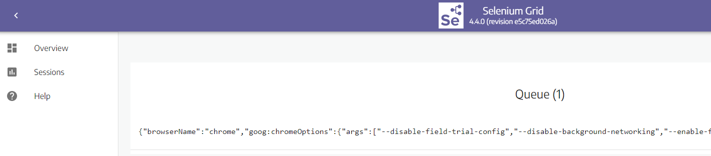
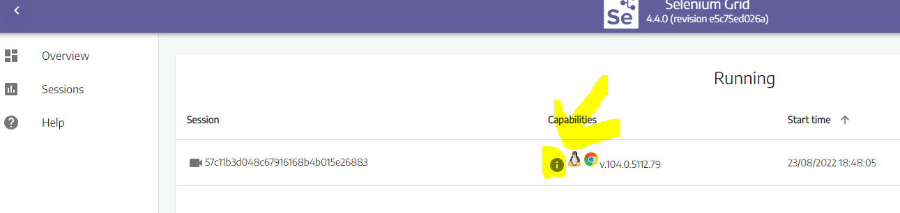

### Selenium grid session created by playwright execution:


### Session content:

```json

{
   "browserName":"chrome",
   "goog:chromeOptions":{
      "args":[
         "--disable-field-trial-config",
         "--disable-background-networking",
         "--enable-features=NetworkService,NetworkServiceInProcess",
         "--disable-background-timer-throttling",
         "--disable-backgrounding-occluded-windows",
         "--disable-back-forward-cache",
         "--disable-breakpad",
         "--disable-client-side-phishing-detection",
         "--disable-component-extensions-with-background-pages",
         "--disable-default-apps",
         "--disable-dev-shm-usage",
         "--disable-extensions",
         "--disable-features=ImprovedCookieControls,LazyFrameLoading,GlobalMediaControls,DestroyProfileOnBrowserClose,MediaRouter,DialMediaRouteProvider,AcceptCHFrame,AutoExpandDetailsElement,CertificateTransparencyComponentUpdater,AvoidUnnecessaryBeforeUnloadCheckSync,Translate",
         "--allow-pre-commit-input",
         "--disable-hang-monitor",
         "--disable-ipc-flooding-protection",
         "--disable-popup-blocking",
         "--disable-prompt-on-repost",
         "--disable-renderer-backgrounding",
         "--disable-sync",
         "--force-color-profile=srgb",
         "--metrics-recording-only",
         "--no-first-run",
         "--enable-automation",
         "--password-store=basic",
         "--use-mock-keychain",
         "--no-service-autorun",
         "--export-tagged-pdf",
         "--no-sandbox",
         "--proxy-server=https://THE_PROXY_I_HAVE_INFORMED:PORT",
         "--proxy-bypass-list=<-loopback>",
         "--proxy-server=https://THE_PROXY_I_HAVE_INFORMED:PORT",
         "--remote-debugging-port=0"
      ]
   }
}

```

### Browser capabilities:


### Capabilities content:

```json
{
   "acceptInsecureCerts":false,
   "browserName":"chrome",
   "browserVersion":"104.0.5112.79",
   "chrome":{
      "chromedriverVersion":"104.0.5112.79 (3cf3e8c8a07d104b9e1260c910efb8f383285dc5-refs/branch-heads/5112@{#1307})",
      "userDataDir":"/tmp/.com.google.Chrome.Pmc4nM"
   },
   "goog:chromeOptions":{
      "debuggerAddress":"localhost:port"
   },
   "networkConnectionEnabled":false,
   "pageLoadStrategy":"normal",
   "platformName":"LINUX",
   "proxy":{
      
   },
   "se:cdp":"ws://a-valid-ip-address:port/session/b711be6355ad7c9a648471f9b6cf56ea/se/cdp",
   "se:cdpVersion":"a-valid-ip-address",
   "se:vnc":"ws://a-valid-ip-address:port/session/b711be6355ad7c9a648471f9b6cf56ea/se/vnc",
   "se:vncEnabled":true,
   "se:vncLocalAddress":"ws://a-valid-ip-address:port",
   "setWindowRect":true,
   "strictFileInteractability":false,
   "timeouts":{
      "implicit":0,
      "pageLoad":300000,
      "script":30000
   },
   "unhandledPromptBehavior":"dismiss and notify",
   "webauthn:extension:credBlob":true,
   "webauthn:extension:largeBlob":true,
   "webauthn:virtualAuthenticators":true
}
```
