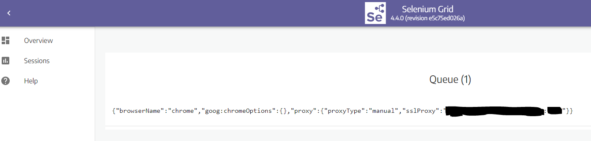
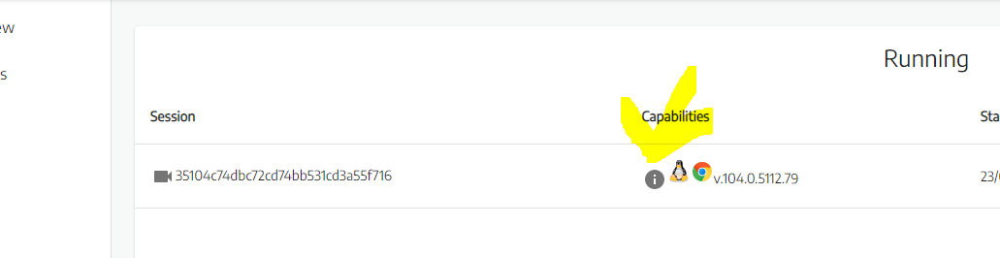

### Selenium grid - Session created by remote webdriver execution:



### Browser capabilities:


### Capabilities content:

```json
{
   "acceptInsecureCerts":false,
   "browserName":"chrome",
   "browserVersion":"104.0.5112.79",
   "chrome":{
      "chromedriverVersion":"104.0.5112.79 (3cf3e8c8a07d104b9e1260c910efb8f383285dc5-refs/branch-heads/5112@{#1307})",
      "userDataDir":"/tmp/.com.google.Chrome.FQCzp9"
   },
   "goog:chromeOptions":{
      "debuggerAddress":"localhost:port"
   },
   "networkConnectionEnabled":false,
   "pageLoadStrategy":"normal",
   "platformName":"LINUX",
   "proxy":{
      "proxyType":"MANUAL",
      "sslProxy":"THE_PROXY_I_HAVE_INFORMED:PORT"
   },
   "se:cdp":"ws://a-valid-ip-address:port/session/bebde315a7cd3ffe52c3be9ee754b805/se/cdp",
   "se:cdpVersion":"a-valid-ip-address",
   "se:vnc":"ws://a-valid-ip-address:port/session/bebde315a7cd3ffe52c3be9ee754b805/se/vnc",
   "se:vncEnabled":true,
   "se:vncLocalAddress":"ws://a-valid-ip-address:port",
   "setWindowRect":true,
   "strictFileInteractability":false,
   "timeouts":{
      "implicit":0,
      "pageLoad":300000,
      "script":30000
   },
   "unhandledPromptBehavior":"dismiss and notify",
   "webauthn:extension:credBlob":true,
   "webauthn:extension:largeBlob":true,
   "webauthn:virtualAuthenticators":true
}
```
